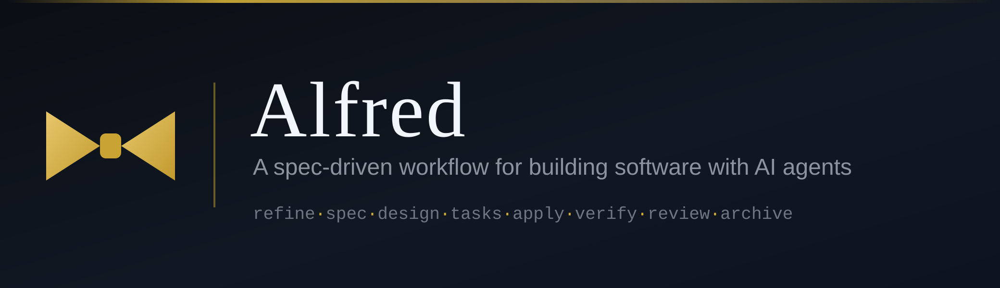

<p align="center">
  
</p>

# Alfred

Alfred is not a program. It is a package of instructions that configures the coding agents
you already use, so that software work follows the same pipeline every time, in every
repository.

Almost all of it is Markdown. The only code is the installer and a small worktree tool.

- [What Alfred gives you](#what-alfred-gives-you)
- [The pipeline](#the-pipeline)
- [Installation](#installation)
- [Everyday use](#everyday-use)
- [Configuration](#configuration)
- [Documentation](#documentation)

---

## What Alfred gives you

### A route chosen before any work starts

A request enters, and the orchestrator proposes a route and waits for you to accept it.
Nothing runs until you do, and a route is never lengthened silently.

| The request | Route | Phases |
|---|---|---|
| Behaviour unchanged | direct | `apply` · `verify` · `review` |
| Behaviour changes | pipeline | `spec` · `design` · `tasks` · `apply` · `verify` · `review` · `archive` |
| Request underspecified | full | `refine` · `research`, then the pipeline |
| Defect reported | diagnose | `diagnose`, then `spec` or `design` |

### Specifications that stay true

Specifications live in the repository, under version control. Every change is written as a
delta, and merging that delta back into the master specifications is a step in the work
rather than something to remember afterwards. Documentation stops going stale because
updating it is not optional.

Where a repository will not accept those documents, Alfred keeps them out of git and still
runs.

### A clean context for every phase

Each phase runs as a subagent that starts empty and receives paths rather than documents.
The orchestrator plans and delegates; it never writes code and never reads a specification,
so its context holds the plan and nothing else for the whole run.

`verify` and `review` are separate phases because they answer different questions, and
`review` runs in a context that never saw the code being written.

### Several changes at once

Changes started together each get their own git worktree and branch, outside the
repository, so two pipelines never write the same working tree or commit to the same
`HEAD`. An installed tool creates, prepares and removes the worktrees; the pipeline inside
each one is the ordinary pipeline, and `status` reports all of them at once. When a change
is archived, its branch is pushed and its worktree removed.

### Changes that span several repositories

A change crossing repository boundaries is planned once at workspace level and executed
independently in each repository, with each one holding a complete description of its own
part and a link back to the system-level requirement. Cross-repository dependencies are
declared and respected.

### Backends you can swap, and run without

Nothing in a skill names a concrete tool.

| Layer | Contract | Backends |
|---|---|---|
| Memory | `memory/CONTRACT.md` | Engram, a shared Postgres, or none |
| Notification | `notify/CONTRACT.md` | terminal, OpenClaw (WhatsApp, Telegram) |
| Task tracker | `tracker/CONTRACT.md` | none (the shipped adapter) |

Every layer degrades rather than failing. With no memory backend the pipeline still runs,
because the artifacts are files and memory only makes them searchable. Switching backend is
a reindex, with nothing to export.

A backend is an adapter file mapping the contract's operations onto one tool, so adding one
is a Markdown file rather than a change to any skill. `tasks` always writes `tasks.md`, and
a tracker, when one is configured, only mirrors it.

### A model per phase

Each phase runs on its own model, assigned through a profile, so bounded execution can run
on a small or local model while judgement stays on a stronger one. The assignment is made
once and changed in one place.

### Nothing tied to a stack

Code conventions live in the repository being worked on, never in Alfred, so one
installation serves a Rails API and a React front end without changing.

---

## The pipeline

| Phase | The question it answers |
|---|---|
| `init` | how is this repository set up |
| `explore` | what does the existing code already say |
| `refine` | what is actually being asked for |
| `research` | what is not known yet |
| `spec` | what must the system do |
| `diagnose` | why does this fail |
| `design` | how will this codebase do it |
| `tasks` | what are the units of work, and in what order |
| `apply` | build it |
| `verify` | does it satisfy the specification |
| `review` | is the code sound |
| `archive` | fold it in, and commit |

Phases differ in whether they start on their own and whether they stop to ask:

| Mode | Starts on its own | Waits for an answer | Phases |
|---|---|---|---|
| `auto` | yes | no | `research`, `spec`, `tasks`, `verify`, `review`, `archive` |
| `interactive` | yes | yes | `refine`, `design`, `diagnose` |
| `confirm` | asks first | no | `apply` |

---

## Installation

Alfred installs at two levels, and the two are easy to confuse:

```
once per machine      registers the orchestrator with your agents
once per repository   sets up one project, from inside the agent
```

There is no package to download and no global `alfred` command.

### Requirements

| | |
|---|---|
| `git` | to clone, and for the worktrees parallel changes run in |
| `python3` | used by the installer for JSON and hashing; no third-party package |
| An agent | Claude Code or OpenCode, already installed |

The installer detects which agents are present and registers the orchestrator with each.

### Step 1 — install once per machine

```bash
git clone https://github.com/markosAMO/Alfred.git
cd Alfred
./install.sh install
```

Use the HTTPS URL unless this machine already has an SSH key on the account. If the clone
did not preserve the executable bit, run `bash install.sh install` instead.

The installer asks which model runs each phase, then writes:

```
~/.config/alfred/                      skills, protocols, templates, adapters
~/.config/alfred/bin/worktree.sh       creates and removes worktrees
~/.config/alfred/profile.json          the model assignment
~/.config/alfred/state.json            the hash of every installed file
~/.claude/agents/                      one subagent per phase
~/.claude/commands/alfred.md           one change, as a slash command
~/.claude/commands/alfred-worktree.md  several changes at once, as a slash command
~/.config/opencode/opencode.json       both orchestrators + one subagent per phase
```

Only Alfred's own agents are written into an existing OpenCode configuration; every other
agent and setting is left as it was.

### Step 2 — confirm it worked

```bash
./install.sh doctor
```

It names anything broken and what to do about it. `./install.sh status` shows what is
installed, which profile is set and which agents were registered.

### Step 3 — set up a repository

Start your agent inside the project and ask the orchestrator to run `init`. Nothing is
copied in by hand.

| Agent | How to reach the orchestrator |
|---|---|
| Claude Code | `/alfred init` |
| OpenCode | press Tab, select `alfred`, then ask for `init` |

`init` creates:

```
AGENTS.md                 with the Alfred block between markers
CLAUDE.md                 pointer to AGENTS.md
docs/architecture.md
docs/code_conventions.md
docs/specs/
docs/changes/
.alfred/config.yaml
.alfred/state/
.alfred/skill-registry.md
```

An existing repository keeps whatever `AGENTS.md` already said: only the block between
`<!-- ALFRED:BEGIN -->` and `<!-- ALFRED:END -->` belongs to Alfred.

### Keeping it up to date

```bash
git pull
./install.sh update
```

`update` replaces only files whose hash still matches what was installed. A file you edited
is reported with its path, never overwritten.

---

## Everyday use

### Installer commands

Run from inside the cloned Alfred repository.

| Command | What it does |
|---|---|
| `./install.sh install` | first-time setup |
| `./install.sh update` | refresh the installed files, leaving modified ones alone |
| `./install.sh models` | change the model profile and regenerate the agents |
| `./install.sh doctor` | check the setup and name what is broken |
| `./install.sh status` | what is installed, which profile, which agents |

### Pipeline commands

Given to the orchestrator inside an agent, not typed into a shell. In Claude Code they
follow the command: `/alfred add google sign-in`. In OpenCode you describe the work to the
selected orchestrator.

| Ask for | What happens |
|---|---|
| a description of the work | routing proposes which phases run |
| `init` | set up this repository |
| `continue` | resume where the run stopped |
| `status` | which changes are open and where they are |
| `reindex` | rebuild the memory index from the files |
| `doctor` | check this repository's setup |
| `abandon` | close a change that will not be finished |

### Two orchestrators

The same pair on both agents: one change in the checkout you are in, and several at once
with a worktree each.

| | Claude Code | OpenCode |
|---|---|---|
| One change | `/alfred` | `alfred` in the picker |
| Several at once | `/alfred-worktree` | `alfred-worktree` in the picker |

---

## Configuration

`alfred.config.yaml` is copied into each repository as `.alfred/config.yaml` and tuned
there. It sets the backends, the phase modes, whether the working documents are kept or
discarded when a change closes, and how many changes may run at once.

Which side is authoritative is the repository's configuration, not the machine's.

---

## Documentation

| | |
|---|---|
| [AGENTS.md](AGENTS.md) | repository map, pipeline, hard rules — for agents modifying Alfred |
| [docs/installation.md](docs/installation.md) | the two installation levels, in full |
| [docs/models.md](docs/models.md) | model assignment and profiles |
| [docs/worktrees.md](docs/worktrees.md) | several changes at once, one worktree each |
| [docs/artifacts.md](docs/artifacts.md) | where Alfred's documents live, and running where they cannot be committed |
| [docs/ephemeral.md](docs/ephemeral.md) | what a change leaves behind once it closes |
| `skills/_shared/` | the protocols every phase relies on |

---

## License

MIT. See [LICENSE](LICENSE).
